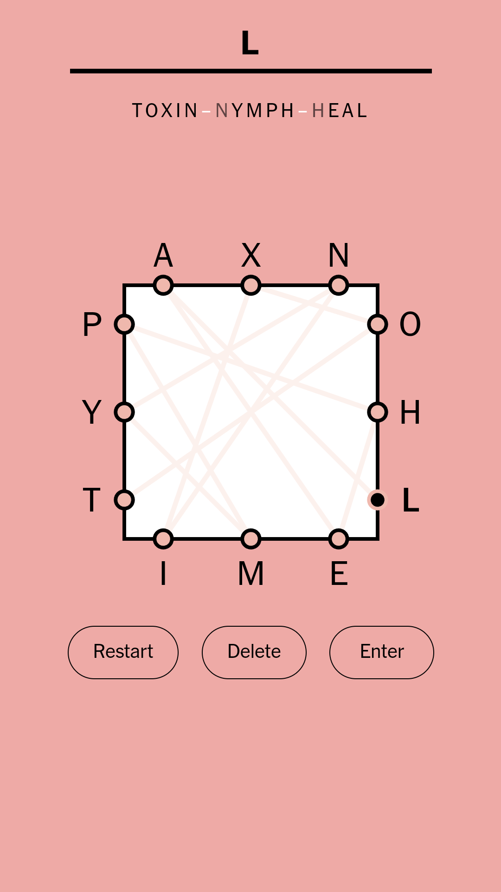

## Solver for the NYT Letter Boxed Game



This solver tries to find 4 words to solve Letter Boxed (though admittedly this screenshot shows solving the puzzle in 3).


### Usage

After loading the file with `[letter_boxed].`, use `solution/2`.  For the puzzle shown above, you would write:

```
solution([['a','x','n'], ['o','h','l'], ['e','m','i'], ['t','y','p']], Words).
```

The letters have to be entered lower-case.  Sorry.  Also the order that you enter the sides and the letters within those sides does not matter.
